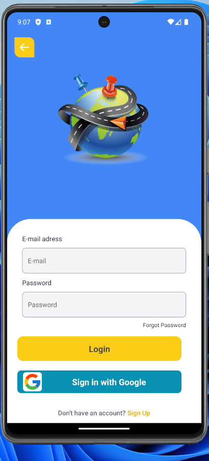
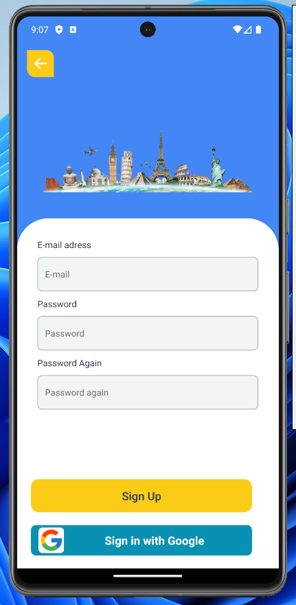
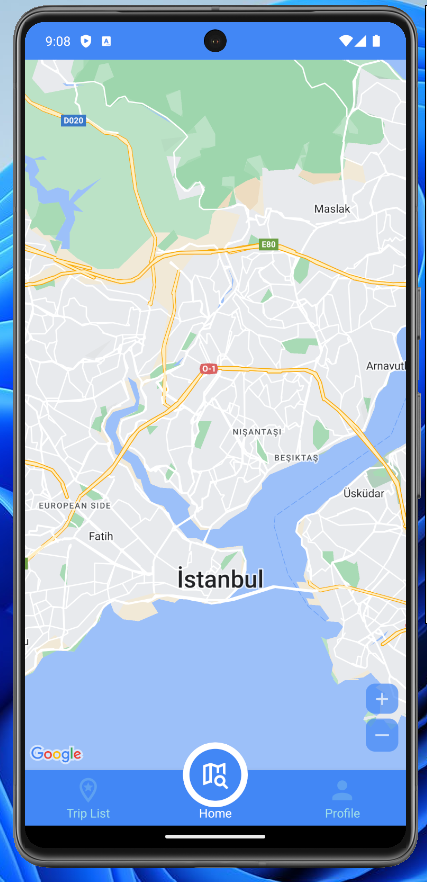
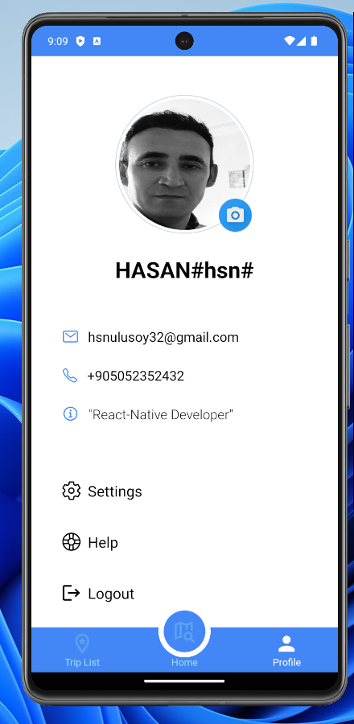
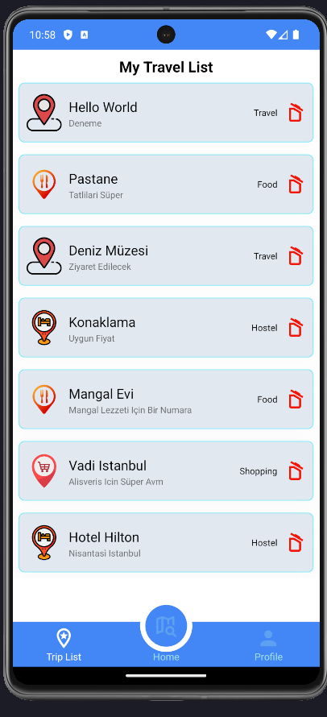

# My Trip App
My Trip App is a mobile application developed using React Native for managing trips and locations. The app allows users to add locations to a trip, categorize them, view details, and remove them. It also includes features for managing user profiles, including adding and editing profile information and uploading profile pictures from the gallery or camera. Users can log in using Google Sign-In or email, and registration is available for new users. Firebase Realtime Database is utilized for real-time data updates.

- Features
-- Google Maps Integration: Users can select locations on the map and add them to their trip.
-- Location Management: Added locations are categorized and listed with the option to view details and remove them.
-- Custom Marker Icons: Marker icons on the map change based on the status of the location.
-- Profile Management: Users can add, edit, or update their profile information.
-- Photo Upload: Users can upload profile pictures from the gallery or take a photo using the camera.
-- Authentication Options: Users can log in using Google Sign-In or email, and new users can register.
-- Real-Time Data Updates: Firebase Realtime Database ensures instant data updates.

** The project code has been shared for monitoring. Some fields are not loaded....

## Preview

# myTrip-ReactNative_Map_Login_Firebase
# myTrip-ReactNative_Map_Login_Firebase_Zustand_Taillwind
